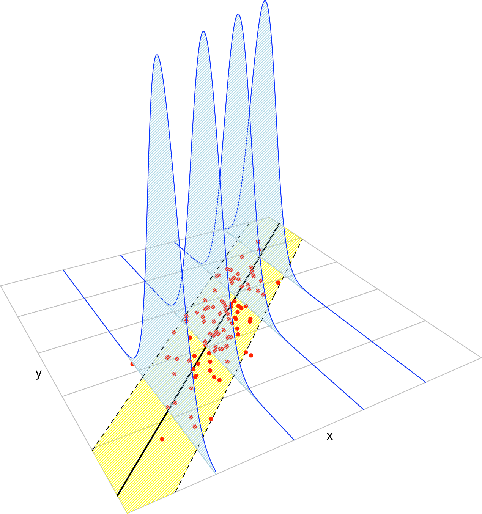
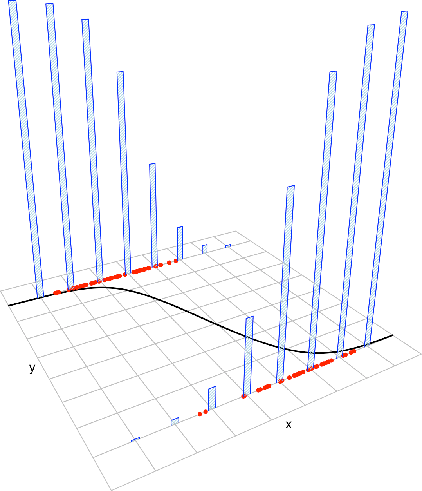

# Regression estimation {#reg}

The relation of two random variables $X$ and $Y$ can be completely characterized by their joint cdf $F$, or equivalently, by the joint pdf $f$ if $(X,Y)$ is continuous, the case we will address. In the regression setting, we are interested in predicting/explaining the *response* $Y$ by means of the *predictor* $X$ from a sample $(X_1,Y_1),\ldots,(X_n,Y_n)$. The role of the variables is not symmetric: $X$ is *used* to predict/explain $Y$. 

The complete knowledge of $Y$ when $X=x$ is given by the conditional pdf: $f_{Y\vert X=x}(y)=\frac{f(x,y)}{f_X(x)}$. While this pdf provides full knowledge, it is also a challenging task: for each $x$ we have to estimate a *curve*! A simpler approach, yet still challenging, is to estimate the conditional mean (a scalar) for each $x$. This is the so-called *regression function*^[Recall that we assume that $(X,Y)$ is continuous.]
$$
m(x):=\mathbb{E}[Y\vert X=x]=\int y\mathrm{d}F_{Y\vert X=x}(y)=\int yf_{Y\vert X=x}(y)\mathrm{d}y.
$$
Thus we aim to provide information about $Y$'s expectation, not distribution, by $X$.

Finally, recall that $Y$ can expressed in terms of $m$ by means of the *location-scale model*:
$$
Y=m(X)+\sigma(X)\varepsilon,
$$
where $\sigma^2(x):=\mathbb{V}\mathrm{ar}[Y\vert X=x]$ and $\varepsilon$ is independent from $X$ and such that $\mathbb{E}[\varepsilon]=0$ and $\mathbb{V}\mathrm{ar}[\varepsilon]=0$.

## Review on parametric regression {#reg-param}

We review now a couple of useful parametric regression models that will be used in the construction of nonparametric regression models.

### Linear regression {#reg-lin}

#### Model formulation and least squares {-}

The multiple linear regression considers employs *multiple* predictors $X_1,\ldots,X_p$^[Not to confuse with a sample!] for explaining a single response $Y$ by *assuming* a linear relation of the form
\begin{align}
Y=\beta_0+\beta_1 X_1+\ldots+\beta_p X_p+\varepsilon (\#eq:lm)
\end{align}
holds between the predictors $X_1,\ldots,X_p$ and the response $Y$. In \@ref(eq:lm), $\beta_0$ is the *intercept* and $\beta_1,\ldots,\beta_p$ are the *slopes*, respectively. $\varepsilon$ is a random variable with mean zero and independent from $X_1,\ldots,X_p$. Another way of looking at \@ref(eq:lm) is
\begin{align}
\mathbb{E}[Y|X_1=x_1,\ldots,X_p=x_p]=\beta_0+\beta_1x_1+\ldots+\beta_px_p, (\#eq:lmexp)
\end{align}
since $\mathbb{E}[\varepsilon|X_1=x_1,\ldots,X_p=x_p]=0$. Therefore, the mean of $Y$ is changing in a *linear* fashion with respect to the values of $X_1,\ldots,X_p$. Hence the interpretation of the coefficients:

- $\beta_0$: is the mean of $Y$ when $X_1=\ldots=X_p=0$.
- $\beta_j$, $1\leq j\leq p$: is the increment in mean of $Y$ for an increment of one unit in $X_j=x_j$, provided that the remaining variables *do not change*.

Figure \@ref(fig:leastsquares2) illustrates the geometrical interpretation of a multiple linear model: a plane in the $(p+1)$-dimensional space. If $p=1$, the plane is the regression line for simple linear regression. If $p=2$, then the plane can be visualized in a three-dimensional plot.

```{r, leastsquares2, echo = FALSE, fig.cap = 'The least squares regression plane $y=\\hat\\beta_0+\\hat\\beta_1x_1+\\hat\\beta_2x_2$ and its dependence on the kind of squared distance considered.', screenshot.alt = "TODO.png", dev = 'png', cache = TRUE, out.width = '90%'}
knitr::include_app('https://ec2-35-177-34-200.eu-west-2.compute.amazonaws.com/least-squares-3D/', height = '700px')
```

The estimation of $\beta_0,\beta_1,\ldots,\beta_p$ is done by minimizing the so-called *residual sum of squares* (RSS). First we need to introduce some helpful matrix notation:

- A sample of $(X_1,\ldots,X_p,Y)$ is $(X_{11},\ldots,X_{1p},Y_1),\ldots,(X_{n1},\ldots,X_{np},Y_n)$, where $X_{ij}$ denotes the $i$-th observation of the $j$-th predictor $X_j$. We denote with $\mathbf{X}_i=(X_{i1},\ldots,X_{ip})$ to the $i$-th observation of $(X_1,\ldots,X_p)$, so the sample simplifies to $(\mathbf{X}_{1},Y_1),\ldots,(\mathbf{X}_{n},Y_n)$

- The *design matrix* contains all the information of the predictors and a column of ones
$$
\mathbf{X}=\begin{pmatrix}
1 & X_{11} & \cdots & X_{1p}\\
\vdots & \vdots & \ddots & \vdots\\
1 & X_{n1} & \cdots & X_{np}
\end{pmatrix}_{n\times(p+1)}
$$

- The *vector of responses* $\mathbf{Y}$, the *vector of coefficients* $\boldsymbol\beta$ and the *vector of errors* are, respectively^[The vectors are regarded as column matrices.],
$$
\mathbf{Y}=\begin{pmatrix}
Y_1 \\
\vdots \\
Y_n
\end{pmatrix}_{n\times 1},\quad\boldsymbol\beta=\begin{pmatrix}
\beta_0 \\
\beta_1 \\
\vdots \\
\beta_p
\end{pmatrix}_{(p+1)\times 1},\text{ and }
\boldsymbol\varepsilon=\begin{pmatrix}
\varepsilon_1 \\
\vdots \\
\varepsilon_n
\end{pmatrix}_{n\times 1}.
$$
Thanks to the matrix notation, we can turn the sample version of the multiple linear model, namely
\begin{align*}
Y_i&=\beta_0 + \beta_1 X_{i1} + \ldots +\beta_p X_{ik} + \varepsilon_i,\quad i=1,\ldots,n,
\end{align*}
into something as compact as
\begin{align*}
\mathbf{Y}=\mathbf{X}\boldsymbol\beta+\boldsymbol\varepsilon.
\end{align*}

The RSS for the multiple linear regression is
\begin{align}
\text{RSS}(\boldsymbol\beta):=&\,\sum_{i=1}^n(Y_i-\beta_0-\beta_1X_{i1}-\ldots-\beta_pX_{ik})^2\nonumber\\
=&\,(\mathbf{Y}-\mathbf{X}\boldsymbol{\beta})'(\mathbf{Y}-\mathbf{X}\boldsymbol{\beta}).(\#eq:rss)
\end{align}
The RSS aggregates the *squared vertical distances* from the data to a regression plane given by $\boldsymbol\beta$. Note that the *vertical distances* are considered because we want to minimize the error in the *prediction* of $Y$^[The treatment of the variables is *not symmetrical*. If that was the case, we will consider perpendicular distances, which yield to Principal Component Analysis (PCA).]. The least squares estimators are *the*^[They are unique and always exist.] minimizers of the RSS:
\begin{align*}
\hat{\boldsymbol{\beta}}:=\arg\min_{\boldsymbol{\beta}\in\mathbb{R}^{p+1}} \text{RSS}(\boldsymbol{\beta}).
\end{align*}
Luckily, thanks to the matrix form of \@ref(eq:rss), it is simple to compute a closed-form expression for the least squares estimates:
\begin{align}
\hat{\boldsymbol{\beta}}=(\mathbf{X}'\mathbf{X})^{-1}\mathbf{X}'\mathbf{Y}.(\#eq:ls)
\end{align}

```{exercise, label = "ls"}
$\hat{\boldsymbol{\beta}}$ can be obtained differentiating \@ref(eq:rss). Prove it using that $\frac{\partial \mathbf{A}\mathbf{x}}{\partial \mathbf{x}}=\mathbf{A}$ and $\frac{\partial f(\mathbf{x})'g(\mathbf{x})}{\partial \mathbf{x}}=f(\mathbf{x})'\frac{\partial g(\mathbf{x})}{\partial \mathbf{x}}+g(\mathbf{x})'\frac{\partial}{\partial f(\mathbf{x})}$ for two vector-valued functions $f$ and $g$.
```

Let's check that indeed the coefficients given by `R`'s `lm` are the ones given by \@ref(eq:ls) in a toy linear model.
```{r, echo = TRUE, collapse = TRUE, cache = TRUE}
# Create the data employed in Figure 3.1

# Generates 50 points from a N(0, 1): predictors and error
set.seed(34567)
x1 <- rnorm(50)
x2 <- rnorm(50)
x3 <- x1 + rnorm(50, sd = 0.05) # Make variables dependent
eps <- rnorm(50)

# Responses
yLin <- -0.5 + 0.5 * x1 + 0.5 * x2 + eps
yQua <- -0.5 + x1^2 + 0.5 * x2 + eps
yExp <- -0.5 + 0.5 * exp(x2) + x3 + eps

# Data
dataAnimation <- data.frame(x1 = x1, x2 = x2, yLin = yLin,
                            yQua = yQua, yExp = yExp)

# Call lm

# lm employs formula = response ~ predictor1 + predictor2 + ... 
# (names according to the data frame names) for denoting the regression 
# to be done
mod <- lm(yLin ~ x1 + x2, data = dataAnimation)
summary(mod)

# mod is a list with a lot of information
# str(mod) # Long output

# Coefficients
mod$coefficients

# Application of formula (3.4)

# Matrix X
X <- cbind(1, x1, x2)

# Vector Y
Y <- yLin

# Coefficients
beta <- solve(t(X) %*% X) %*% t(X) %*% Y
beta
```

```{exercise}
Compute $\boldsymbol{\beta}$ for the regressions `yLin ~ x1 + x2`, `yQua ~ x1 + x2` and `yExp ~ x2 + x3` using equation \@ref(eq:ls) and the function `lm`. Check that the fitted plane and the coefficient estimates are coherent.
```

Once we have the least squares estimates $\hat{\boldsymbol{\beta}}$, we can define the next two concepts:

- The *fitted values* $\hat Y_1,\ldots,\hat Y_n$, where
\begin{align*}
\hat Y_i:=\hat\beta_0+\hat\beta_1X_{i1}+\cdots+\hat\beta_pX_{ik},\quad i=1,\ldots,n.
\end{align*}
They are the vertical projections of $Y_1,\ldots,Y_n$ into the fitted line (see Figure \@ref(fig:leastsquares2)). In a matrix form, inputting \@ref(eq:rss)
$$
\hat{\mathbf{Y}}=\mathbf{X}\hat{\boldsymbol{\beta}}=\mathbf{X}(\mathbf{X}'\mathbf{X})^{-1}\mathbf{X}'\mathbf{Y}=\mathbf{H}\mathbf{Y},
$$
where $\mathbf{H}:=\mathbf{X}(\mathbf{X}'\mathbf{X})^{-1}\mathbf{X}'$ is called the *hat matrix* because it "puts the hat into $\mathbf{Y}$". What it does is to project $\mathbf{Y}$ into the regression plane (see Figure \@ref(fig:leastsquares2)).

- The *estimated residuals* $\hat \varepsilon_1,\ldots,\hat \varepsilon_n$, where
\begin{align*}
\hat\varepsilon_i:=Y_i-\hat Y_i,\quad i=1,\ldots,n.
\end{align*}
They are the vertical distances between actual data and fitted data.

#### Model assumptions {-}

Up to know we have not made any probabilistic assumption on the data. $\hat{\boldsymbol{\beta}}$ was derived from geometrical arguments, not probabilistic ones. However, some probabilistic assumptions are required for inferring the *unknown* population coefficients $\boldsymbol{\beta}$ from the sample $(\mathbf{X}_1, Y_1),\ldots,(\mathbf{X}_n, Y_n)$.

```{r, linearmodel2, echo = FALSE, out.width = '90%', fig.cap = 'The key concepts of the simple linear model. The blue densities denote the conditional density of $Y$ for each cut in the $X$ axis. The yellow band denotes where the $95\\%$ of the data is, according to the model. The red points represent data following the model.', cache = TRUE}

```

The assumptions of the multiple linear model are:

i. **Linearity**: $\mathbb{E}[Y|X_1=x_1,\ldots,X_p=x_p]=\beta_0+\beta_1x_1+\ldots+\beta_px_p$.
ii. **Homoscedasticity**: $\mathbb{V}\text{ar}[\varepsilon_i]=\sigma^2$, with $\sigma^2$ constant for $i=1,\ldots,n$.
iii. **Normality**: $\varepsilon_i\sim\mathcal{N}(0,\sigma^2)$ for $i=1,\ldots,n$.
iv. **Independence of the errors**: $\varepsilon_1,\ldots,\varepsilon_n$ are independent (or uncorrelated, $\mathbb{E}[\varepsilon_i\varepsilon_j]=0$, $i\neq j$, since they are assumed to be normal).

A good one-line summary of the linear model is the following (independence is assumed)
\begin{align*}
Y|(X_1=x_1,\ldots,X_p=x_p)\sim \mathcal{N}(\beta_0+\beta_1x_1+\ldots+\beta_px_p,\sigma^2).
\end{align*}
The above summary is the *population version* of the linear model (it is expressed in terms of the random variables). The *sample version* that summarizes assumptions i--iv is
$$
\mathbf{Y}|\mathbf{X}\sim \mathcal{N}_n(\mathbf{X}\boldsymbol{\beta},\sigma^2\mathbf{I}).
$$
Using this result, it is easy obtain the log-likelihood function of $Y_1,\ldots,Y_n$ conditionally^[We assume that the randomness is on the response only.] on $X_1,\ldots,X_n$ as
\begin{align}
\ell(\boldsymbol{\beta})=\log\phi_{\sigma^2\mathbf{I}}(\mathbf{Y}-\mathbf{X}\boldsymbol{\beta})=\sum_{i=1}^n\log\phi_{\sigma}(Y_i-(\mathbf{X}\boldsymbol{\beta})_i).(\#eq:ell)
\end{align}
The last result justifies the consideration of the least squares estimate: it equals the maximum likelihood estimator derived under assumptions i--iv.

```{theorem}
Under assumptions i--iv, the maximum likelihood estimate of $\boldsymbol{\beta}$ is the least squares estimate \@ref(eq:ls):
$$
\hat{\boldsymbol{\beta}}_\mathrm{ML}=\arg\max_{\boldsymbol{\beta}\in\mathbb{R}^{p+1}}\ell(\boldsymbol{\beta})=(\mathbf{X}'\mathbf{X})^{-1}\mathbf{X}\mathbf{Y}.
$$
```
```{proof}
Expanding the first equality at \@ref(eq:ell) gives ($|\sigma^2\mathbf{I}|^{1/2}=\sigma^{n}$)
$$
\ell(\boldsymbol{\beta})=-\log((2\pi)^{n/2}\sigma^n)-\frac{1}{2\sigma^2}(\mathbf{Y}-\mathbf{X}\boldsymbol{\beta})'(\mathbf{Y}-\mathbf{X}\boldsymbol{\beta}).
$$
Optimizing $\ell$ does not require knowledge on $\sigma^2$, since differentiating with respect to $\boldsymbol{\beta}$ and equating to zero gives (see Exercise \@ref(exr:ls)) $\frac{1}{\sigma^2}(\mathbf{Y}-\mathbf{X}\boldsymbol{\beta})'\mathbf{X}=0$. The result follows from that.
```

### Logistic regression {#reg-log}

#### Model formulation {-}

When the response $Y$ can take only two values, codified for convenience as $1$ (success) and $0$ (failure), it is called a *binary* variable. A binary variable, known also as a *Bernoulli variable*, is a $\mathrm{B}(1, p)$. Recall that $\mathbb{\mathrm{B}(1, p)}=\mathbb{P}[\mathrm{B}(1, p)=1]=p$.

If $Y$ is a binary variable and $X_1,\ldots,X_p$ are predictors associated to $Y$, the purpose in *logistic regression* is to estimate
\begin{align}
p(x_1,\ldots,x_p):=&\,\mathbb{P}[Y=1|X_1=x_1,\ldots,X_p=x_p]\nonumber\\
=&\,\mathbb{E}[Y|X_1=x_1,\ldots,X_p=x_p],(\#eq:expp)
\end{align}
this is, how the probability of $Y=1$ is changing according to particular values, denoted by $x_1,\ldots,x_p$, of the predictors $X_1,\ldots,X_p$. A tempting possibility is to consider a linear model for \@ref(eq:expp), $p(x_1,\ldots,x_p)=\beta_0+\beta_1x_1+\ldots+\beta_px_p$. However, such a model will run into serious problems inevitably: negative probabilities and probabilities larger than one.

The solution is to consider a function to encapsulate the value of $z=\beta_0+\beta_1x_1+\ldots+\beta_px_p$, in $\mathbb{R}$, and map it back to $[0,1]$. There are several alternatives to do so, based on distribution functions $F:\mathbb{R}\longrightarrow[0,1]$ that deliver $y=F(z)\in[0,1]$. Different choices of $F$ give rise to different models, the most common being the *logistic distribution function*:
\begin{align*}
\mathrm{logistic}(z):=\frac{e^z}{1+e^z}=\frac{1}{1+e^{-z}}.
\end{align*}
Its inverse, $F^{-1}:[0,1]\longrightarrow\mathbb{R}$, known as the *logit function*, is
\begin{align*}
\mathrm{logit}(p):=\mathrm{logistic}^{-1}(p)=\log\frac{p}{1-p}.
\end{align*}
This is a *link function*, this is, a function that maps a given space (in this case $[0,1]$) into $\mathbb{R}$. The term link function is employed in *generalized linear models*, which follow exactly the same philosophy of the logistic regression -- mapping the domain of $Y$ to $\mathbb{R}$ in order to apply there a linear model. We will concentrate here exclusively on the logit as a link function. Therefore, the *logistic model* is
\begin{align}
p(x_1,\ldots,x_p)&=\mathrm{logistic}(\beta_0+\beta_1x_1+\ldots+\beta_px_p)\nonumber\\
&=\frac{1}{1+e^{-(\beta_0+\beta_1x_1+\ldots+\beta_px_p)}}.(\#eq:eq-log)
\end{align}
The linear form inside the exponent has a clear interpretation:

- If $\beta_0+\beta_1x_1+\ldots+\beta_px_p=0$, then $p(x_1,\ldots,x_p)=\frac{1}{2}$ ($Y=1$ and $Y=0$ are equally likely).
- If $\beta_0+\beta_1x_1+\ldots+\beta_px_p<0$, then $p(x_1,\ldots,x_p)<\frac{1}{2}$ ($Y=1$ less likely).
- If $\beta_0+\beta_1x_1+\ldots+\beta_px_p>0$, then $p(x_1,\ldots,x_p)>\frac{1}{2}$ ($Y=1$ more likely).

To be more precise on the interpretation of the coefficients $\beta_0,\ldots,\beta_p$ we need to introduce the *odds*. The **odds is an equivalent way of expressing the distribution of probabilities in a binary variable**. Since $\mathbb{P}[Y=1]=p$ and $\mathbb{P}[Y=0]=1-p$, both the success and failure probabilities can be inferred from $p$. Instead of using $p$ to characterize the distribution of $Y$, we can use
\begin{align}
\mathrm{odds}(Y)=\frac{p}{1-p}=\frac{\mathbb{P}[Y=1]}{\mathbb{P}[Y=0]}.(\#eq:eq-odds)
\end{align}
The odds is the *ratio between the probability of success and the probability of failure*. It is extensively used in betting^[Recall that the result of a bet is binary: you win or lose the bet.] due to its better interpretability. For example, if a horse $Y$ has a probability $p=2/3$ of winning a race ($Y=1$), then the odds of the horse is
$$
\text{odds}=\frac{p}{1-p}=\frac{2/3}{1/3}=2.
$$
This means that the horse has a *probability of winning that is twice larger than the probability of losing*. This is sometimes written as a $2:1$ or $2 \times 1$ (spelled "two-to-one"). Conversely, if the odds of $Y$ is given, we can easily know what is the probability of success $p$, using the inverse of \@ref(eq:eq-odds):
$$
p=\mathbb{P}[Y=1]=\frac{\text{odds}(Y)}{1+\text{odds}(Y)}.
$$
For example, if the odds of the horse were $5$, that would correspond to a probability of winning $p=5/6$.

```{remark}
Recall that the odds is a number in $[0,+\infty]$. The $0$ and $+\infty$ values are attained for $p=0$ and $p=1$, respectively. The log-odds (or logit) is a number in $[-\infty,+\infty]$.
```
We can rewrite \@ref(eq:eq-log) in terms of the odds \@ref(eq:eq-odds). If we do so, we have:
\begin{align*}
\mathrm{odds}(Y|&X_1=x_1,\ldots,X_p=x_p)\\
&=\frac{p(x_1,\ldots,x_p)}{1-p(x_1,\ldots,x_p)}\\
&=e^{\beta_0+\beta_1x_1+\ldots+\beta_px_p}\\
&=e^{\beta_0}e^{\beta_1x_1}\ldots e^{\beta_px_p}.
\end{align*}
This provides the following interpretation of the coefficients:

- $e^{\beta_0}$: is the odds when $X_1=\ldots=X_p=0$.
- $e^{\beta_j}$, $1\leq j\leq k$: is the **multiplicative** increment of the odds for an increment of one unit in $X_j=x_j$, provided that the remaining variables *do not change*. If the increment in $X_j$ is of $r$ units, then the multiplicative increment in the odds is $(e^{\beta_j})^r$.

#### Model assumptions and estimation {-}

Some probabilistic assumptions are required for performing inference on the model parameters $\boldsymbol\beta$ from the sample $(\mathbf{X}_1, Y_1),\ldots,(\mathbf{X}_n, Y_n)$. These assumptions are somehow simpler than the ones for linear regression.

```{r, logisticmodel, echo = FALSE, out.width = '90%', fig.cap = 'The key concepts of the logistic model. The blue bars represent the conditional distribution of probability of $Y$ for each cut in the $X$ axis. The red points represent data following the model.', cache = TRUE}

```

The assumptions of the logistic model are the following:

i. **Linearity in the logit**^[An equivalent way of stating this assumption is $p(\mathbf{x})=\mathrm{logistic}(\beta_0+\beta_1x_1+\ldots+\beta_px_p)$.]: $\mathrm{logit}(p(\mathbf{x}))=\log\frac{
p(\mathbf{x})}{1-p(\mathbf{x})}=\beta_0+\beta_1x_1+\ldots+\beta_px_p$.
ii. **Binariness**: $Y_1,\ldots,Y_n$ are binary variables.
iii. **Independence**: $Y_1,\ldots,Y_n$ are independent.

A good one-line summary of the logistic model is the following (independence is assumed)
\begin{align*}
Y|(X_1=x_1,\ldots,X_p=x_p)&\sim\mathrm{Ber}\left(\mathrm{logistic}(\beta_0+\beta_1x_1+\ldots+\beta_px_p)\right)\\
&=\mathrm{Ber}\left(\frac{1}{1+e^{-(\beta_0+\beta_1x_1+\ldots+\beta_px_p)}}\right).
\end{align*}

Since $Y_i\sim \mathrm{Ber}(p(\mathbf{X}_i))$, $i=1,\ldots,n$, the log-likelihood of $\boldsymbol{\beta}$ is
\begin{align*}
\ell(\boldsymbol{\beta})=&\,\sum_{i=1}^n\log\left(p(\mathbf{X}_i)^{Y_i}(1-p(\mathbf{X}_i))^{1-Y_i}\right)\\
=&\,\sum_{i=1}^n\left\{Y_i\log(p(\mathbf{X}_i))+(1-Y_i)\log(1-p(\mathbf{X}_i))\right\}.
\end{align*}
Unfortunately, due to the non-linearity of the optimization problem there are no explicit expressions for $\hat{\boldsymbol{\beta}}$. These have to be obtained numerically by means of an iterative procedure, which may run into problems in low sample situations with perfect classification.

Figure \@ref(fig:maximumlikelihood) shows how the log-likelihood changes with respect to the values for $(\beta_0,\beta_1)$ in three data patterns.
```{r, maximumlikelihood, echo = FALSE, fig.cap = 'The logistic regression fit and its dependence on $\\beta_0$ (horizontal displacement) and $\\beta_1$ (steepness of the curve). Recall the effect of the sign of $\\beta_1$ in the curve: if positive, the logistic curve has an \'s\' form; if negative, the form is a reflected \'s\'.', screenshot.alt = "TODO.png", dev = 'png', cache = TRUE, out.width = '90%'}
knitr::include_app('https://ec2-35-177-34-200.eu-west-2.compute.amazonaws.com/log-maximum-likelihood/', height = '900px')
```

The data of the illustration has been generated with the following code:

Let's check that indeed the coefficients given by `R`'s `glm` are the ones that maximize the likelihood of the animation of Figure \@ref(fig:maximumlikelihood). We do so for `y ~ x1`.
```{r, echo = TRUE, collapse = TRUE, cache = TRUE}
# Create the data employed in Figure 3.4

# Data
set.seed(34567)
x <- rnorm(50, sd = 1.5)
y1 <- -0.5 + 3 * x
y2 <- 0.5 - 2 * x
y3 <- -2 + 5 * x
y1 <- rbinom(50, size = 1, prob = 1 / (1 + exp(-y1)))
y2 <- rbinom(50, size = 1, prob = 1 / (1 + exp(-y2)))
y3 <- rbinom(50, size = 1, prob = 1 / (1 + exp(-y3)))

# Data
dataMle <- data.frame(x = x, y1 = y1, y2 = y2, y3 = y3)

# Call glm

# glm employs formula = response ~ predictor1 + predictor2 + ... 
# (names according to the data frame names) for denoting the regression 
# to be done. We need to specify family = "binomial" to make a
# logistic regression
mod <- glm(y1 ~ x, family = "binomial", data = dataMle)
summary(mod)

# mod is a list with a lot of information
# str(mod) # Long output

# Coefficients
mod$coefficients

# Plot the fitted regression curve
xGrid <- seq(-5, 5, l = 200)
yGrid <- 1 / (1 + exp(-(mod$coefficients[1] + mod$coefficients[2] * xGrid)))
plot(xGrid, yGrid, type = "l", col = 2, xlab = "x", ylab = "y")
points(x, y1)
```

```{exercise}
For the regressions `y ~ x2` and `y ~ x3`, do the following:

- Check that $\boldsymbol{\beta}$ is indeed maximizing the likelihood as compared with Figure \@ref(fig:maximumlikelihood).
- Plot the fitted logistic curve and compare it with the one in Figure \@ref(fig:maximumlikelihood).

```

## Kernel regression estimation {#reg-kre}

### Nadaraya-Watson estimator {#reg-nw}

Our objective is to estimate the regression function $m$ nonparametrically. Due to its definition, we can rewrite it as follows:
\begin{align*}
m(x)=&\,\mathbb{E}[Y\vert X=x]\nonumber\\
=&\,\int y f_{Y\vert X=x}(y)\mathrm{d}y\nonumber\\
=&\,\frac{\int y f(x,y)\mathrm{d}y}{f_X(x)}.
\end{align*}
This expression shows an interesting point: the regression function can be computed from the density joint density $f$ and the marginal $f_X$. Therefore, given a sample $(X_1,Y_1),\ldots,(X_n,Y_n)$, an estimate of $m$ follows by replacing the previous densities by their kdes. To that aim, recall that in Exercise \@ref(exr:multkde) we defined a multivariate extension of the kde based on product kernels. For the two dimensional case, the kde with equal bandwidths $\mathbf{h}=(h,h)$ is 
\begin{align}
\hat f(x,y;h)=\frac{1}{n}\sum_{i=1}^nK_{h}(x_1-X_{i})K_{h}(y-Y_{i}).(\#eq:kdem)
\end{align}
Using \@ref(eq:kdem),
\begin{align*}
m(x)\approx&\,\frac{\int y \hat f(x,y;h)\mathrm{d}y}{\hat f_X(x;h)}\\
=&\,\frac{\int y \hat f(x,y;h)\mathrm{d}y}{\hat f_X(x;h)}\\
=&\,\frac{\int y \frac{1}{n}\sum_{i=1}^nK_h(x-X_i)K_h(y-Y_i)\mathrm{d}y}{\frac{1}{n}\sum_{i=1}^nK_h(x-X_i)}\\
=&\,\frac{\frac{1}{n}\sum_{i=1}^nK_h(x-X_i)\int y K_h(y-Y_i)\mathrm{d}y}{\frac{1}{n}\sum_{i=1}^nK_h(x-X_i)}\\
=&\,\frac{\frac{1}{n}\sum_{i=1}^nK_h(x-X_i)Y_i}{\frac{1}{n}\sum_{i=1}^nK_h(x-X_i)}.
\end{align*}
This yields the so-called **Nadaraya-Watson**^[Termed due to the coetaneous proposals by @Nadaraya1964 and @Watson1964.] estimate:
\begin{align}
\hat m(x;0,h):=\frac{1}{n}\sum_{i=1}^n\frac{K_h(x-X_i)}{\frac{1}{n}\sum_{i=1}^nK_h(x-X_i)}Y_i=\sum_{i=1}^nW^0_{i}(x)Y_i, (\#eq:nw)
\end{align}
where $W^0_{i}(x):=\frac{K_h(x-X_i)}{\sum_{i=1}^nK_h(x-X_i)}$. This estimate can be seen as a weighted average of $Y_1,\ldots,Y_n$ by means of the set of weights $\{W_{n,i}(x)\}_{i=1}^n$ (check that they add to one). The set of weights depends on the evaluation point $x$. That means that the Nadaraya-Watson estimator is a **local mean of $Y_1,\ldots,Y_n$ around $X=x$**. 

Let's implement the Nadaraya-Watson estimate to get a feeling of how it works in practice.

```{r, echo = TRUE, collapse = TRUE, cache = TRUE}
# Nadaraya-Watson
mNW <- function(x, X, Y, h, K = dnorm) {
	
  # Arguments
  # x: evaluation points
	# X: vector (size n) with the predictors
	# Y: vector (size n) with the response variable
	# h: bandwidth
	# K: kernel
  
  # Matrix of size n x length(x)
  Kx <- sapply(X, function(Xi) K((x - Xi) / h) / h)
  
  # Weights
  W <- Kx / rowSums(Kx) # Column recycling!
  
  # Means at x ("drop" to drop the matrix attributes)
  drop(W %*% Y)
  
}

# Generate some data to test the implementation
set.seed(12345)
n <- 100
eps <- rnorm(n, sd = 2)
m <- function(x) x^2 * cos(x)
X <- rnorm(n, sd = 2)
Y <- m(X) + eps
xGrid <- seq(-10, 10, l = 500)

# Bandwidth
h <- 0.5

# Plot data
plot(X, Y)
rug(X, side = 1); rug(Y, side = 2)
lines(xGrid, m(xGrid), col = 1)
lines(xGrid, mNW(x = xGrid, X = X, Y = Y, h = h), col = 2)
legend("topright", legend = c("True regression", "Nadaraya-Watson"), 
       lwd = 2, col = 1:2)
```

```{exercise}
Implement your own version of the Nadaraya-Watson estimator in `R` and compare it with `mNW`. You may focus only on the normal kernel. Are you able to improve the speed of `mNW`? Use `system.time` to measure the running times for a sample size of $n=10000$.
```

The code below illustrates the effect of varying $h$ for the Nadaraya-Watson estimator using `manipulate`.

```{r, echo = TRUE, eval = FALSE, collapse = TRUE, cache = TRUE}
# Simple plot of N-W for varying h's
manipulate({
  
  # Plot data
  plot(X, Y)
  rug(X, side = 1); rug(Y, side = 2)
  lines(xGrid, m(xGrid), col = 1)
  lines(xGrid, mNW(x = xGrid, X = X, Y = Y, h = h), col = 2)
  legend("topright", legend = c("True regression", "Nadaraya-Watson"),
         lwd = 2, col = 1:2)

}, h = slider(min = 0.01, max = 2, initial = 0.5, step = 0.01))

```

### Local polynomial regression {#reg-locpoly}

Nadaraya-Watson can be seen as a particular case of a *local polynomial fit*, specifically, the one corresponding to a *local constant fit*. The motivation for the local polynomial fit comes from attempting to the minimize the RSS
\begin{align}
\sum_{i=1}^n(Y_i-m(X_i))^2.(\#eq:mrss)
\end{align}
This is not achievable directly, since no knowledge on $m$ is available. However, by a $p$-th order Taylor expression it is possible to obtain that, for $x$ close to $X_i$,
\begin{align}
m(X_i)\approx&\, m(x)+m'(x)(X_i-x)+\frac{m''(x)}{2}(X_i-x)^2\nonumber\\
&+\cdots+\frac{m^{(p)}(x)}{p!}(X_i-x)^p.(\#eq:mtay)
\end{align}
Replacing \@ref(eq:mtay) in \@ref(eq:mrss), we have that
\begin{align}
\sum_{i=1}^n\left(Y_i-\sum_{j=0}^p\frac{m^{(j)}(x)}{j!}(X_i-x)^j\right)^2.(\#eq:mder)
\end{align}
This expression is still not workable: it depends on $m^{(j)}(x)$, $j=0,\ldots,p$, which of course are unknown! The *great idea* is to set $\beta_j:=\frac{m^{(j)}(x)}{j!}$ and turn \@ref(eq:mder) into a linear regression problem where the unknown parameters are $\boldsymbol{\beta}=(\beta_0,\beta_1,\ldots,\beta_p)'$:
\begin{align}
\sum_{i=1}^n\left(Y_i-\sum_{j=0}^p\beta_j(X_i-x)^j\right)^2.(\#eq:minbe)
\end{align}
While doing so, an estimate of $\boldsymbol{\beta}$ automatically will yield estimates for $m^{(j)}(x)$, $j=0,\ldots,p$, and we know how to obtain $\hat{\boldsymbol{\beta}}$ by minimizing \@ref(eq:minbe). The final touch is to make the contributions of $X_i$ dependent on the distance to $x$ by weighting with kernels:
\begin{align}
\hat{\boldsymbol{\beta}}:=\arg\min_{\boldsymbol{\beta}\in\mathbb{R}^{p+1}}\sum_{i=1}^n\left(Y_i-\sum_{j=0}^p\beta_j(X_i-x)^j\right)^2K_h(x-X_i).(\#eq:hatb)
\end{align}
Denoting
$$
\mathbf{X}:=\begin{pmatrix}
1 & X_1-x & \cdots & (X_1-x)^p\\
\vdots & \vdots & \ddots & \vdots\\
1 & X_n-x & \cdots & (X_n-x)^p\\
\end{pmatrix}_{n\times(p+1)}
$$
and
$$
\mathbf{W}:=\mathrm{diag}(K_h(X_1-x),\ldots, K_h(X_n-x)),\quad
\mathbf{Y}:=\begin{pmatrix}
Y_1\\
\vdots\\
Y_n
\end{pmatrix}_{n\times 1},
$$
we can re-express \@ref(eq:hatb) into a *weighted least squares problem* whose exact solution is
\begin{align}
\hat{\boldsymbol{\beta}}&=\arg\min_{\boldsymbol{\beta}\in\mathbb{R}^{p+1}} (\mathbf{Y}-\mathbf{X}\boldsymbol{\beta})'\mathbf{W}(\mathbf{Y}-\mathbf{X}\boldsymbol{\beta})\\
&=(\mathbf{X}'\mathbf{W}\mathbf{X})^{-1}\mathbf{X}'\mathbf{W}\mathbf{Y}.(\#eq:betaw)
\end{align}

```{exercise}
Using the equalities given in Exercise \@ref(exr:ls), prove \@ref(eq:betaw).
```

The estimate for $m(x)$ is then computed as 
\begin{align*}
\hat m(x;p,h):&=\hat\beta_0\\
&=\mathbf{e}_1'(\mathbf{X}'\mathbf{W}\mathbf{X})^{-1}\mathbf{X}'\mathbf{W}\mathbf{Y}\\
&=\sum_{i=1}^nW^p_{i}(x)Y_i,
\end{align*}
where $W^p_{i}(x):=\mathbf{e}_1'(\mathbf{X}'\mathbf{W}\mathbf{X})^{-1}\mathbf{X}'\mathbf{W}\mathbf{e}_i$ and $\mathbf{e}_i$ is the $i$-th canonical vector. Just as the Nadaraya-Watson, the local polynomial estimator is a *linear combination of the responses*. Two cases deserve special attention:

- $p=0$ is the *local constant estimator* or the Nadaraya-Watson estimator (Exercise \@ref(exr:nw)). In this situation, the estimator has explicit weights, as we saw before:
$$
W_i^0(x)=\frac{K_h(x-X_i)}{\sum_{j=1}^nK_h(x-X_j)}.
$$
- $p=1$ is the *local linear estimator*, which has weights equal to (Exercise \@ref(exr:loc)):
\begin{align}
W_i^1(x)=\frac{\hat s_2(x;h)-\hat s_1(x;h)(X_i-x)}{\hat s_2(x;h)\hat s_0(x;h)-\hat s_1(x;h)^2}K_h(x-X_i),(\#eq:we)
\end{align}
where $\hat s_r(x;h):=\frac{1}{n}\sum_{i=1}^n(X_i-x)^rK_h(x-X_i)$.

`KernSmooth`'s `locpoly` implements the local polynomial estimator. Below are some examples of its usage.

```{r, echo = TRUE, collapse = TRUE, cache = TRUE}
# Generate some data to test the implementation
set.seed(123456)
n <- 100
eps <- rnorm(n, sd = 2)
m <- function(x) x^3 * sin(x)
X <- rnorm(n, sd = 1.5)
Y <- m(X) + eps
xGrid <- seq(-10, 10, l = 500)

# Bandwidth
h <- 0.25
lp0 <- locpoly(x = X, y = Y, bandwidth = h, degree = 0, range.x = c(-10, 10), 
               gridsize = 500)
lp1 <- locpoly(x = X, y = Y, bandwidth = h, degree = 1, range.x = c(-10, 10), 
               gridsize = 500)

# Plot data
plot(X, Y)
rug(X, side = 1); rug(Y, side = 2)
lines(xGrid, m(xGrid), col = 1)
lines(lp0$x, lp0$y, col = 2)
lines(lp1$x, lp1$y, col = 3)
legend("bottom", legend = c("True regression", "Local constant", 
                         "Local linear"),
       lwd = 2, col = 1:3)
```

```{r, echo = TRUE, eval = FALSE, collapse = TRUE, cache = TRUE}
# Simple plot of local polynomials for varying h's
manipulate({
  
  # Plot data
  lpp <- locpoly(x = X, y = Y, bandwidth = h, degree = p, range.x = c(-10, 10), 
                 gridsize = 500)
  plot(X, Y)
  rug(X, side = 1); rug(Y, side = 2)
  lines(xGrid, m(xGrid), col = 1)
  lines(lpp$x, lpp$y, col = p + 2)
  legend("bottom", legend = c("True regression", "Local polynomial fit"),
         lwd = 2, col = c(1, p + 2))

}, h = slider(min = 0.01, max = 2, initial = 0.5, step = 0.01),
p = slider(min = 0, max = 4, initial = 0, step = 1))

```

## Asymptotic properties {#reg-asymp}

The purpose of this section is to provide some key asymptotic results for the bias, variance and asymptotic normality of the local linear and local constant estimators. These provide useful insights on the effect of $p$, $m$, $f$ and $\sigma^2$ in the performance of the estimators. Proofs and detailed analysis are skipped; we refer the interested reader to @Ruppert1994, Section 5.3 @Wand1995, and Section 3.2 @Fan1996.

Along this section we will make the following assumptions:

- **A1**. $m$ is twice continuously differentiable.
- **A2**. $\sigma^2$ is continuous and positive.
- **A3**. $f$ is continuously differentiable and positive.
- **A4**. The kernel $K$ is a symmetric and bounded pdf with finite second moment and square integrable.
- **A5**. $h=h_n$ is a deterministic sequence of bandwidths such that, when $n\to\infty$, $h\to0$ and $nh\to\infty$.

The bias and variance are expanded in their *conditional* versions on the predictor's sample $X_1,\ldots,X_n$. The reason of analyzing the conditional instead of the *unconditional* versions is avoiding technical difficulties that integration with respect to the predictor's density may pose.

```{theorem}
Under **A1**--**A5**, the conditional bias and variance of the local constant ($p=0$) and local linear ($p=1$) estimators are
\begin{align}
\mathrm{Bias}[\hat m(x;p,h)\vert X_1,\ldots,X_n]&=B_p(x)h^2+o_\mathbb{P}(h^2),(\#eq:mbias)\\
\mathbb{V}\mathrm{ar}[\hat m(x;p,h)\vert X_1,\ldots,X_n]&=\frac{R(K)}{nhf(x)}\sigma^2(x)+o_\mathbb{P}((nh)^{-1}),(\#eq:mvar)
\end{align}
where
$$
B_p(x)=\frac{\mu_2(K)}{2}\left\{m''(x)+2\frac{m'(x)f'(x)}{f(x)}1_{\{p=0\}}\right\}.
$$
```

The bias and variance expressions \@ref(eq:mbias) and \@ref(eq:mvar) yield interesting insights:

- The bias decreases with $h$ *quadratically* for $p=0,1$. The bias at $x$ is directly proportional to $m''(x)$ if $p=1$ and affected by $m''(x)$ if $p=0$. This has the same interpretation as in the density setting:

    - The bias is negative in concave regions, *i.e.* $\{x\in\mathbb{R}:m(x)''<0\}$. These regions correspod to *peaks and modes of $m$*
    - Conversely, the bias is positive in convex regions, *i.e.* $\{x\in\mathbb{R}:m(x)''>0\}$. These regions correspod to *valleys of $m$*.
    - **The wilder the curvature $m''$, the harder to estimate $m$**.
    
- The bias for $p=0$ at $x$ is affected by $m'(x)$, $f'(x)$, and $f(x)$. Precisely, **the lower the density $f(x)$, the larger the bias**. And **the faster $m$ and $f$ change at $x$, the larger the bias**. Thus the bias of the local constant estimator is much more sensible to $m(x)$ and $f(x)$ than the local linear (which is only sensible to $m''(x)$). Particularly, the fact that it depends on $f'(x)$ and $f(x)$ is referred as the *design bias* since it depends merely on the predictor's distribution.

- The variance depends directly on $\frac{\sigma^2(x)}{f(x)}$ for $p=0,1$. As a consequence, **the lower the density and larger the conditional variance, the more variable is $\hat m(\cdot;p,h)$.** The variance decreases at a factor of $(nh)^{-1}$ due to the effective sample size.

Finally, we have the asymptotic pointwise normality of the estimator.

```{theorem}
Assume that $\mathbb{E}[(Y-m(x))^{2+\delta}\vert X=x]<\infty$ for some $\delta>0$. Then, under **A1**--**A5**,
\begin{align}
&\sqrt{nh}(\hat m(x;p,h)-\mathbb{E}[\hat m(x;p,h)])\stackrel{d}{\longrightarrow}\mathcal{N}\left(0,\frac{R(K)\sigma^2(x)}{f(x)}\right),(\#eq:mnorm1)\\
&\sqrt{nh}\left(\hat m(x;p,h)-m(x)-B_p(x)h^2\right)\stackrel{d}{\longrightarrow}\mathcal{N}\left(0,\frac{R(K)\sigma^2(x)}{f(x)}\right).(\#eq:mnorm2)
\end{align}

```


## Bandwidth selection {#reg-bwd}

Bandwidth selection is, as in kernel density estimation, of key practical importance. Several bandwidth selectors, in the spirit of the plug-in and cross-validation ideas discussed in Section \@ref(dens-bwd) have been proposed. There are, for example, a rule-of-thumb analogue (see Section 4.2 in @Fan1996) and a direct plug-in analogue (see Section 5.8 in @Wand1995). For simplicity, we will focus only on the **cross-validation** bandwidth selector.

Following an analogy with the fit of the linear model, we could look for the bandwidth $h$ such that it minimizes the RSS of the form
\begin{align*}
\frac{1}{n}\sum_{i=1}^n(Y_i-\hat m(X_i;p,h))^2.(\#eq:badcv)
\end{align*}
However, this is a bad idea. Attempting to minimize \@ref(eq:badcv) always leads to $h\approx 0$ that results in a useless interpolation of the data. Let's see an example.

```{r, echo = TRUE, eval = TRUE, collapse = TRUE, cache = TRUE}
# Grid for representing (3.22)
hGrid <- seq(0.1, 1, l = 200)^2
error <- sapply(hGrid, function(h) 
  mean((Y - mNW(x = X, X = X, Y = Y, h = h))^2))

# Error curve
plot(hGrid, error, type = "l")
rug(hGrid)
abline(v = hGrid[which.min(error)], col = 2)
```
The root of the problem is the comparison of $Y_i$ with $\hat m(X_i;p,h)$, since there is nothing that forbids $h\to0$ and as a consequence $\hat m(X_i;p,h)\to Y_i$. We can change this behavior if we compare $Y_i$ with $\hat m_{-i}(X_i;p,h)$, the **leave-one-out estimate** computed without the $i$-th datum $(X_i,Y_i)$:
\begin{align*}
\mathrm{CV}(h)&:=\frac{1}{n}\sum_{i=1}^n(Y_i-\hat m_{-i}(X_i;p,h))^2,\\
h_\mathrm{CV}&:=\arg\min_{h>0}\mathrm{CV}(h).
\end{align*}
The optimization of the above criterion might seem to be computationally expensive, since it is required to compute $n$ regressions for a *single* evaluation of the objective function.

```{proposition, label = "cv"}
The weights of the leave-one-out estimator $\hat m_{-i}(x;p,h)=\sum_{\substack{j=1\\j\neq i}}^nW_{-i,j}^p(x)Y_j$ can be obtained from $\hat m(x;p,h)=\sum_{i=1}^nW_{i}^p(x)Y_i$:
\begin{align*}
W_{-i,j}^p(x)=\frac{W^p_j(x)}{\sum_{\substack{k=1\\k\neq j}}^nW_k^p(x)}.
\end{align*}
This implies that
\begin{align*}
\mathrm{CV}(h)=\frac{1}{n}\sum_{i=1}^n\left(\frac{Y_i-\hat m(X_i;p,h)}{1-W_i^p(X_i)}\right)^2.
\end{align*}

```

Let's implement this simple bandwidth selector in `R`.

```{r, echo = TRUE, eval = TRUE, collapse = TRUE, cache = TRUE}
# Generate some data to test the implementation
set.seed(12345)
n <- 100
eps <- rnorm(n, sd = 2)
m <- function(x) x^2 + sin(x)
X <- rnorm(n, sd = 1.5)
Y <- m(X) + eps
xGrid <- seq(-10, 10, l = 500)

# Objective function
cvNW <- function(X, Y, h, K = dnorm) {
  	sum(((Y - mNW(x = X, X = X, Y = Y, h = h, K = K)) / 
  	       (1 - K(0) / colSums(K(outer(X, X, "-") / h))))^2)
} 

# Find optimum CV bandwidth, with sensible grid
bw.cv.grid <- function(X, Y, 
                       h.grid = diff(range(X)) * (seq(0.1, 1, l = 200))^2, 
                       K = dnorm, plot.cv = FALSE) {
	obj <- sapply(h.grid, function(h) cvNW(X = X, Y = Y, h = h, K = K))
  h <- h.grid[which.min(obj)]
  if (plot.cv) {
    plot(h.grid, obj, type = "o")
    rug(h.grid)
    abline(v = h, col = 2, lwd = 2)
  }
  h
}

# Bandwidth
h <- bw.cv.grid(X = X, Y = Y, plot.cv = TRUE)
h

# Plot result
plot(X, Y)
rug(X, side = 1); rug(Y, side = 2)
lines(xGrid, m(xGrid), col = 1)
lines(xGrid, mNW(x = xGrid, X = X, Y = Y, h = h), col = 2)
legend("topright", legend = c("True regression", "Nadaraya-Watson"), 
       lwd = 2, col = 1:2)
```

```{exercise}
Compare if 
```

<!--

## Confidence intervals {#reg-ci}

Variance estimation.
Asymptotic infeasible.
Wild bootstrap.

## Local likelihood {#reg-loclik}

Binary (Wasserman)
Cross-validation 

$\ell(f)=$

-->

## Exercises {#reg-exercises}

This is the list of evaluable exercises for Chapter \@ref(reg). The number of stars represents an estimate of their difficulty: easy ($\star$), medium ($\star\star$), and hard ($\star\star\star$).

```{exercise, label = "nw"}
(theoretical, $\star$) Show that the local polynomial estimator yields the Nadaraya-Watson when $p=0$. Use \@ref(eq:betaw) to obtain \@ref(eq:nw).
```

```{exercise}
(theoretical, $\star$) TODO
```

```{exercise}
(theoretical, $\star\star$) TODO
```

```{exercise}
(theoretical, $\star\star$) TODO
```

```{exercise, label = "loc"}
(theoretical, $\star\star\star$) Obtain the weight expressions \@ref(eq:we) of the local linear estimator. *Hint:* use the matrix inversion formula for $2\times2$ matrices.
```

```{exercise}
(theoretical, $\star\star\star$) Prove the two implications of Proposition \@ref(prp:cv) for the Nadaraya-Watson estimator ($p=0$).
```

```{exercise}
(practical, $\star$) TODO
```

```{exercise}
(practical, $\star$) TODO
```

```{exercise}
(practical, $\star\star$) TODO
```

```{exercise}
(practical, $\star\star$) TODO
```

```{exercise}
(practical, $\star\star\star$) Implement the local linear estimator. The function must take a sample `X`, a sample `Y`, the points `x` at which the estimate should be obtained, the bandwidth `h` and the kernel `K`. Test its correct behaviour by estimating an artificial dataset that follows a linear model.
```

```{exercise}
(practical, $\star\star\star$) TODO.
```

